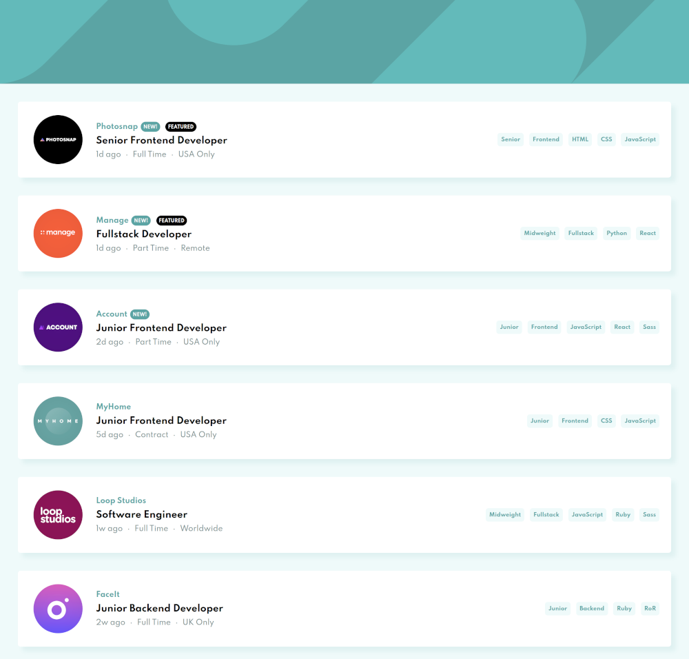
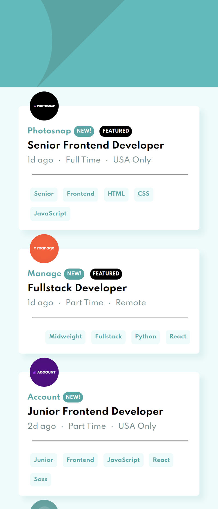

# Frontend Mentor - Job listings with filtering solution

This is a solution to the [Job listings with filtering challenge on Frontend Mentor](https://www.frontendmentor.io/challenges/job-listings-with-filtering-ivstIPCt). Frontend Mentor challenges help you improve your coding skills by building realistic projects.

## Table of contents

-   [Overview](#overview)
    -   [The challenge](#the-challenge)
    -   [Screenshot](#screenshot)
    -   [Links](#links)
-   [My process](#my-process)
    -   [Built with](#built-with)
    -   [What I learned](#what-i-learned)
    -   [Continued development](#continued-development)
    -   [Useful resources](#useful-resources)
-   [Author](#author)
-   [Acknowledgments](#acknowledgments)

## Overview

### The challenge

Users should be able to:

-   View the optimal layout for the site depending on their device's screen size
-   See hover states for all interactive elements on the page
-   Filter job listings based on the categories

### Screenshot

#### Desktop



#### Mobile



### Links

-   Solution URL: [https://github.com/Ifouldm/job-listing](https://github.com/Ifouldm/job-listing)
-   Live Site URL: [http://github.obidex.com/job-listing/](http://github.obidex.com/job-listing/)

## Run Project

```
npm install
```

### Compiles and hot-reloads for development

```
npm run serve
```

### Built with

-   Semantic HTML5 markup
-   CSS custom properties
-   Flexbox
-   Mobile-first workflow
-   [Vue](https://vuejs.org/) - Vue Framework

## Author

-   Website - [Matthew Ifould](https://obidex.com)
-   Frontend Mentor - [@ifouldm](https://www.frontendmentor.io/profile/ifouldm)
-   Github - [ifouldm](https://www.twitter.com/ifouldm)
